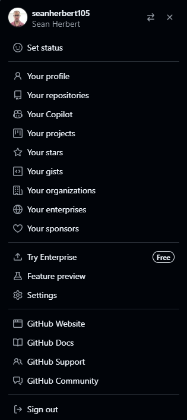
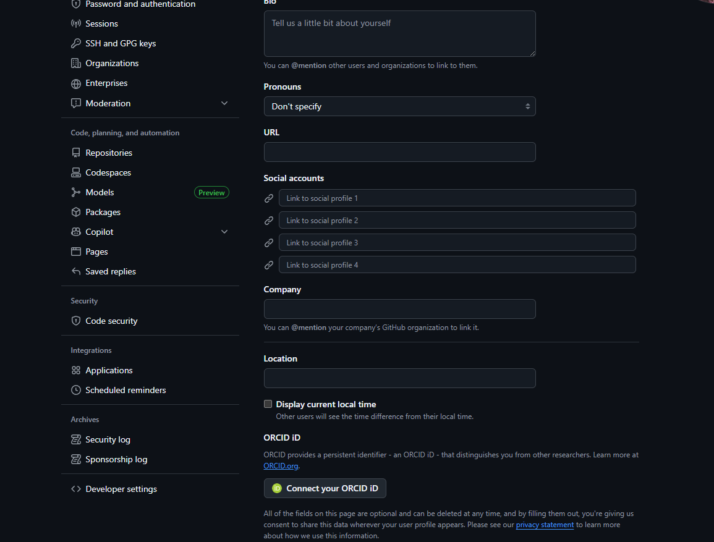
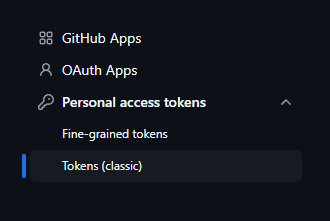
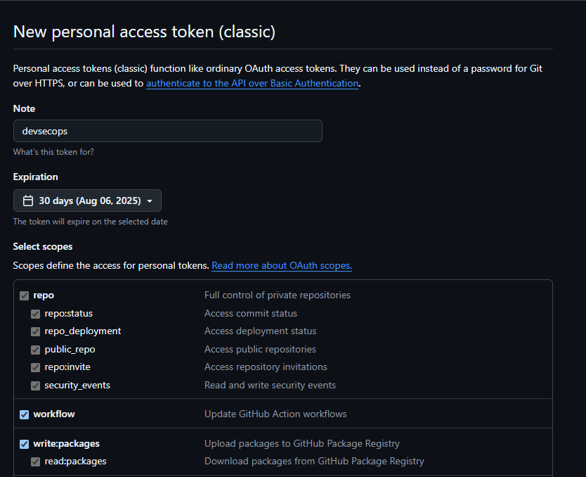
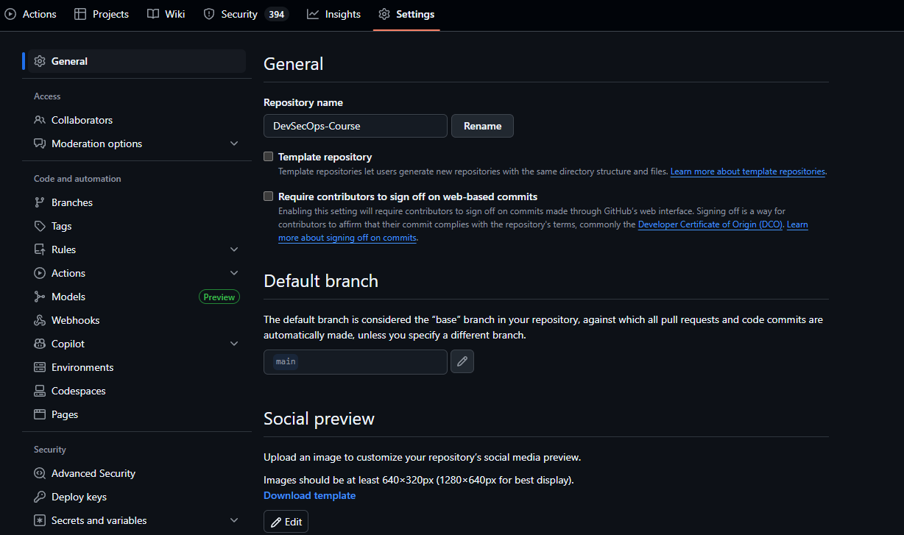

# DevSecOps Course Labs

The hands on labs in this course are completely optional, but highly recommended.
There is no better way to understand how this works in further detail than to try.

## Getting Started

To begin, start by downloading Docker Desktop on your personal computer

### Lab 1 - Running your first container

This command will get you started by deploying an NGINX webserver

```
docker run --name nginx-example -d -p 80:80 nginx:1.27.5
```

This command will execute container to run with the name of nginx-example in a detached state.
The port exposed will be 80 and will be using the nginx container image version 1.27.5.

Once completed, run the following command to stop the container from running. 

```
docker stop nginx-example
```

After, run the following command to remove the container on your laptop.

```
docker rm nginx-example
```

### Lab 2 - Create your first developer tokens to run a CI/CD pipeline

1. Fork the repository on DevSecOps-Course which will create your own working copy. 
2. Go under settings
3. Go under developer settings
4. Generate new token (classic)
5. Give full permissions to the following components
    - repo
    - workflow
    - write:packages

Below are additional screen shots to assist you on doing those 5 tasks. 


<br>

<br>

<br>

<br>

After the tokens are created, in order to run CI/CD pipelines using my existing GitHub Actions workflows, you need to copy and paste your newly generated token as a secret. 
1. Create a new repository secret under Actions secrets and variables
2. Name the secret REGISTRY_TOKEN (or else the pipeline will break)
3. Paste the value of the newly generated token in the previous steps


<br>

### Lab 3 - Running your first container orchestration

This one will be really short, but essentially run the following command to deploy the 
voting application using the following docker-compose.yml file given within the 
root file directory. 

First, login to your ghcr.io registry where you cloned 

```
docker compose up --detach
```

If you recieve an error, make sure you're within the DevSecOps-Course directory.

### Lab 3 - Deploying a Department of Defense Software Factory

Begin first by installing ArgoCD, run the following installation script to begin

```
kubectl apply -k https://github.com/argoproj/argo-cd/manifests/crds\?ref\=stable
```

Next will be installing Traefik, that will be our ingress controller which allows access
to our applications external to the Kubernetes cluster.

```
helm repo add traefik https://traefik.github.io/charts
helm repo update
helm install traefik traefik/traefik
```
